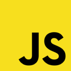
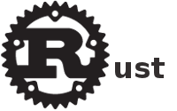
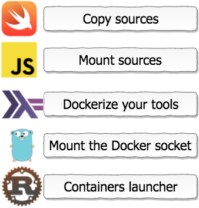

name: inverse
layout: true
class: center, middle, inverse
---
layout: false
template: inverse
class: center, middle

<br><br>
# 5 Containers Patterns for 5 Languages
<br><br><br>


---
template: inverse

## Hello

---
layout: false

.large[
<br>
.left[Haikel (@hguemar)..................... ]
<br>
.left[Mario (@mariolet)........................ ]
<br>
.left[Mike (@mjbright).......................... ]
]

---
layout: false
.left-column[
.footnote[@hguemar, @mariolet, @mjbright ]

  ## Agenda
]
.right-column[
<br>
  - Swift and `Copy Sources`
<br><br>
  - Javascript and `Mount Sources`
<br><br>
  - Haskell and `Dockerize your tools`
<br><br>
  - Go and `Mount the Docker socket`
<br><br>
  - Rust and `Containers launcher`
]

---

template: inverse

## Swift and Copy sources

---

.left-column[
.footnote[@hguemar, @mariolet, @mjbright ]

  ## SWIFT
  ### Language
]
.right-column[

<br><br>
- Maintained by Apple
- First version published in 2014
- Open Source since November 2015 for iOS, OS X, Linux and FreeBSD
- Inspired by Objective-C, Rust, Haskell, Ruby, Python, C#
- Multi-paradigm : OO and functional
- Static, strongly typed with type inference
- GC based on Automatic Reference Counting      
- n.1 language in StackOverflow 2015 ranking
]

---

.left-column[
.footnote[@hguemar, @mariolet, @mjbright ]

  ## SWIFT
  ### Language
]
.right-column[
```swift
// Hello World
print("Hello World")


// Build and execution one application
swift hello.swift


// Function declaration
func factorial(n: Int) -> Int {
	// do something....
	return i
}


// If condition
if val == 0 {
  // Some code here
} else if val == 1 {
  // Some code here
}


// For loop
for num in 1...100 {//iterate from 1 to 100
  // do something....
}
```
]

---

.left-column[
.footnote[@hguemar, @mariolet, @mjbright ]

  ## SWIFT
  ### Language
  ### Container
]
.right-column[
## Pattern: Copy sources 
- Build Pattern
- Sources are copied inside the image
- Simplest build pattern
- A new image should be built for every code change
- Build tools are included in the image
- Usually a different image is used to run the application
]

---
.left-column[
.footnote[@hguemar, @mariolet, @mjbright ]

  ## SWIFT
  ### Language
  ### Container
]
.right-column[
## Demo: Copy Swift sources 
**Docker Image**<br>containerslanguages/swift

**Source code**<br>https://github/l0rd/containers-and-languages/swift

**Build and run commands**
```bash
docker build -t swiftapp .
docker run -d swiftapp
```
]

---

template: inverse

## JavaScript and Mount sources

---

.left-column[
.footnote[@hguemar, @mariolet, @mjbright ]

  ## SWIFT
## JS
  ### Language
]
.right-column[

<br><br>
- Created in 10 days in May 1995 by Brendan Eich
- Has become a standard: ECMAScript
- Dynamic, untyped, and interpreted programming language
- Supports object oriented programming through prototypes (influenced by Self)
- Supports functional programming (influenced by Scheme)
- Got popular with Ajax technique
- Started as a client side technology
- Now popular as a server side language too (NodeJS)
]

---

.left-column[
.footnote[@hguemar, @mariolet, @mjbright ]

  ## SWIFT
## JS
  ### Language
]
.right-column[
```javascript
// Hello World
console.log('Hello World');

// Execute one application in the browser
// console or with nodeJS
node hello.js

// Function declaration
function factorial(n) {
    // do something...
    return i;
}

// If condition
if (a == b) {
    // Some code
}

// For loop
for (i = 0; i < 10; i++) {
    // Some code
}

for (x in some_object) {
    // Some code that uses object[x];
}
```
]

---

.left-column[
.footnote[@hguemar, @mariolet, @mjbright ]

  ## SWIFT
## JS
  ### Language
  ### Container
]
.right-column[
## Pattern: Mount sources 

- Build and Runtime Pattern
- Source folder is bind mounted when running the container
- Pattern particularly suited for dynamic languages
- Not recommended for production
- No need to rebuild or restart container when sources are updated
- Build tools are included in the image
- The same image can be used to compile and run the application
]

---
.left-column[
.footnote[@hguemar, @mariolet, @mjbright ]

  ## SWIFT
## JS
  ### Language
  ### Container
]
.right-column[
## Demo: Mount JS sources  

**Docker Image**<br>containerslanguages/js

**Source code**<br>https://github/l0rd/containers-and-languages/js

**Build and run command**
```bash
docker run -d -v $(pwd):/src/ containerslanguages/js
```
]

---

template: inverse

## Haskell and Dockerize your tools

---

.left-column[
.footnote[@hguemar, @mariolet, @mjbright ]

  ## SWIFT
  ## JS
## HASKELL
  ### Language
]
.right-column[

- First released in 1990
- Influenced by Miranda (proprietary)
- Haskell is a standard (Haskell 2010) and it's best known implementation is the Glasgow Haskell Compiler (GHC)
- Pure functional language (data are immutable)
- Static, strongly typed with type inference
- Indentation is significant in Haskell (**layout** vs `;`+`{}`)
- Functions can be declared recursively
```haskell
factorial 1 = 1
factorial n = n * factorial (n-1)
```
]

---

.left-column[
.footnote[@hguemar, @mariolet, @mjbright ]

  ## SWIFT
  ## JS
## HASKELL
  ### Language
]
.right-column[
```haskell
-- Hello World
main = putStrLn "Hello, World!"

-- Build et Execution of an application
ghc -o hello hello.hs
./hello

-- Function declaration
factorial n =
  -- do something ...

-- If condition
if val == 0
  then
    -- Some code here

-- Recursion is used for loops
printStringNTimes 0 = return ()
printStringNTimes n =
  do
   -- Do Something
   printStringNTimes (n-1)

-- To print and integer
print i
```
]

---

.left-column[
.footnote[@hguemar, @mariolet, @mjbright ]

  ## SWIFT
  ## JS
## HASKELL
  ### Language
  ### Container
]
.right-column[
## Pattern: Dockerize your tools 
- Build Pattern
- A tool is packaged and distributed as a Docker image
- Allow to run multiple versions of the same tool
- The tool version and installation is described in a Dockerfile
- Files can be shared between the container and the host with volumes
- `alias` command can be used to make it easier to run
]

---
.left-column[
.footnote[@hguemar, @mariolet, @mjbright ]

  ## SWIFT
  ## JS
## HASKELL
  ### Language
  ### Container
]
.right-column[
## Demo: Dockerize GHC  

**Docker Image**<br>containerslanguages/haskell

**Source code**<br>https://github/l0rd/containers-and-languages/haskell

**Run command**
```bash
# Make the alias of the dockerized tool
alias ghc="docker run -d -v $(pwd):/src/ \
                       containerslanguages/haskell"
# Run the tool
ghc
```
]

---

template: inverse

## Go and Mount the Docker socket

---

.left-column[
.footnote[@hguemar, @mariolet, @mjbright ]

  ## SWIFT
  ## JS
  ## HASKELL
## GO
  ### Language
]
.right-column[

- Development started at Google in 2006
- Influenced by C, Newsqueak, Moudula, Smalltalk and Python
- Object Oriented style with composition over inheritance
- Static, strongly typed with type inference
- Designed for:
  - Big size projects (as Java or C++)
  - As fast as C
  - As fast to compile and run as a Python
- Some features have been sacrificed to keep the language simple. A well known example are Generics.
]

---

.left-column[
.footnote[@hguemar, @mariolet, @mjbright ]

  ## SWIFT
  ## JS
  ## HASKELL
## GO
  ### Language
]
.right-column[
```go
// Hello World
package main
import "fmt"
func main() {
	fmt.Println("Hello, World!")
}

// Build and execution of an application
go build hello.go && ./hello
// That's equivalent to
go run hello.go

// Function declaration
func factorial(n int) int {
	do something....
	return i
}

// If condtion
if val == 0 {
  // Some code here
}

// For loop
for i := 1; i < 101; i++  {
  //iterate from 1 to 100
}
```
]

---

.left-column[
.footnote[@hguemar, @mariolet, @mjbright ]

  ## SWIFT
  ## JS
  ## HASKELL
## GO
  ### Language
  ### Container
]
.right-column[
## Pattern: Mount the Docker socket 
- Runtime Pattern
- The Docker socket is bind mounted when the container is started
- Allow to manage containers from another container
- Usages:
  - Container monitoring tools
  - CI/CD tools
  - Containers launchers
]

---
.left-column[
.footnote[@hguemar, @mariolet, @mjbright ]

  ## SWIFT
  ## JS
  ## HASKELL
## GO
  ### Language
  ### Container
]
.right-column[
## Demo:  Mount the Docker socket  

**Docker Image**<br>containerslanguages/go

**Source code**<br>https://github/l0rd/containers-and-languages/go

**Run command**
```bash
docker run -v $(pwd):/src/ \
        -v /var/run/docker.sock:/var/run/docker.sock \
        containerslanguages/go
```
]

---

template: inverse

## Rust and Containers launcher

---

.left-column[
.footnote[@hguemar, @mariolet, @mjbright ]

  ## ...
  ## HASKELL
  ## GO
## RUST  
  ### Language
]
.right-column[

<br><br>
- Development started at Mozilla in 2009
- Open Source community driven project
- Influenced by C, C++ and Haskell
- Object Oriented and functional
- Static, strongly typed with type inference
- As fast as C++
- Still not completely stable
- Most loved language in 2016 according to StackOverflow
]

---

.left-column[
.footnote[@hguemar, @mariolet, @mjbright ]

  ## ...
  ## HASKELL
  ## GO
## RUST  
  ### Language
]
.right-column[
```rust
// Hello World
fn main() {
    println!("Hello World!");
}

// Build and execution of an application
rustc hello.rs
./hello

// Function declaration
fn factorial(n: i32) -> i32 {
	// do something....
	i // do not use `;` to return a value
}

// If condition
if val == 0 {
  // Some code here
}

// For in loop
for num in 1..101 { //iterate from 1 to 100
  // do something....
}

// To print an integer
println!("{}", i);
```
]

---

.left-column[
.footnote[@hguemar, @mariolet, @mjbright ]

  ## ...
  ## HASKELL
  ## GO
## RUST  
  ### Language
  ### Container
]
.right-column[
## Pattern: Containers launcher 
- Runtime Pattern
- The Docker socket is bind mounted when the container is started
- Use to compose multiple containers without Docker compose or similar
]

---
.left-column[
.footnote[@hguemar, @mariolet, @mjbright ]

  ## ...
  ## HASKELL
  ## GO
## RUST  
  ### Language
  ### Container
]
.right-column[
## Demo: Rust containers launcher  

**Docker Image**<br>containerslanguages/rust

**Source code**<br>https://github/l0rd/containers-and-languages/rust

**Run command**
```bash
docker run -v $(pwd):/src/ \
        -v /var/run/docker.sock:/var/run/docker.sock \
        containerslanguages/rust
```
]

---

template: inverse

## Conclusion

---

class: center
.footnote[@hguemar, @mariolet, @mjbright ]
<br><br>


---

## Resources

- [A Swift Tour](https://developer.apple.com/library/ios/documentation/Swift/Conceptual/Swift_Programming_Language/GuidedTour.html)

- [The Rust Programming Language Book](https://doc.rust-lang.org/stable/book/)

- [Haskell wiki list of Haskell tutorials](https://wiki.haskell.org/Tutorials)

- [A tour of Go](https://tour.golang.org/)

---

template: inverse

## Thank you

http://l0rd.github.io/talks/containers-and-languages

[@hguemar, @mariolet, @mjbright]

---

TODO

- JS cheatsheet
- Swift container
- Swift app (TODO list)
- JS container
- JS app (1024)
- Haskell container
- Haskell app (?)
- Golang container
- Golang app (Unit tested app or container monitoring app)
- Rust container
- Rust app (?)
